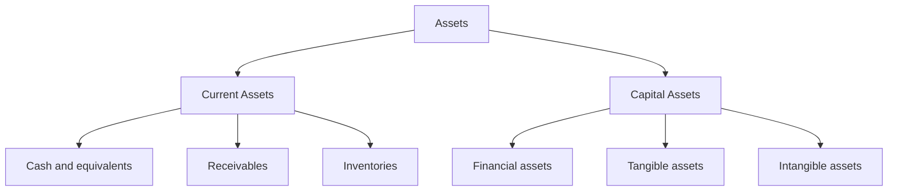
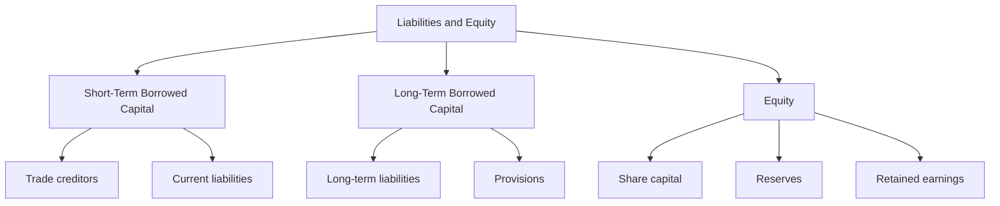

### Tags: [[Rules]], [[Beginning Balance Sheet]], [[Closing Balance Sheet]], [[CO]], [[Current Assets]], [[Capital Assets]], [[Capital]], [[Equity]]
# Annual Account

## Summary
This document provides a comprehensive overview of key accounting concepts and practices, with a focus on Swiss accounting standards. Key points include:

1. **Swiss Accounting Principles**: The three guiding principles of Swiss accounting - Reliability, Prudence, and Essentiality - which form the foundation of financial reporting in Switzerland.
2. **Balance Sheet Structure**: Detailed breakdown of the balance sheet elements as required by the Swiss Code of Obligations (Arts. 958 - 959), including current and capital assets, short-term and long-term borrowed capital, and equity components.
3. **Key Financial Concepts**: Definitions and explanations of fundamental accounting terms such as assets, liabilities, equity, and various financial statements.
4. **Financial Calculations**: Formulas and interpretations for important financial metrics, including working capital, current ratio, debt-to-equity ratio, and various profit measures (Gross Profit, EBIT, EBT, Annual Profit/Loss).
5. **Practical Applications**: Example problems demonstrating the calculation and interpretation of key financial ratios.
6. **Financial Statement Impacts**: Overview of how different accounting elements affect various financial statements, including the balance sheet, income statement, and statement of changes in equity.

These notes serve as a comprehensive guide for understanding Swiss accounting practices, financial statement preparation, and interpretation of key financial metrics. They combine theoretical knowledge with practical applications, providing a solid foundation for financial analysis and decision-making in a Swiss business context.

## Definitions and Important Concepts
- The income statement spans from the beginning [[Balance Sheet]] to the closing [[Balance Sheet]]
- The balance sheet shows the value and composition of the assets of the company and financing choices (liabilities and equity). They are 2 sides of the same entity: company’s wealth at a given date.
![[Pasted image 20240924112736.png]]
- Since the Assets and Liabilities compose the wealth of the firm we need to respect the formula:
![[Pasted image 20240924112847.png]]
- Items are part parts of the balance sheet under _assets_ if they can be sold and provide cash through a transaction of their vale. 
- Assets are the set of all tangible, intangible and financial resources available to the company. Yet, for reasons of reliability, accounting only includes resources that meet the following conditions:
	- may be disposed of (is owned by the company or controlled by it thanks to a “financial” leasing)
	- due to past events (it excludes future assets)
	- a cash inflow is probable (via sale or use)
	- and their value can be reliably estimated (for instane by their historical cost).
	To be noted that Human and Rented resources are not included in these conditions.
- Current assets include cash, assets that will be converted into cash within a year (e.g. short-term securities, accounts receivables) and single-use resouces (e.g. inventories) 
- Capital assets are resources that are intended to be used for several years (e.g. vehicles, buildings, patents, etc.) or that will be realized beyond one year (e.g. financial investments, loans granted or securities held for several years).
- Borrowed capital and shareholders’ equity must be entered on the balance sheet as liabilities.
- Liabilities must be entered on the balance sheet as borrowed capital if they have been caused by past events, a cash outflow is probable and their value can be reliably estimated.
- Liabilities must be entered on the balance sheet as current liabilities if they are expected to fall due for payment within one year of the balance sheet date or within the normal operating cycle. All other liabilities must be entered on the balance sheet as long-term liabilities.
- The shareholders’ equity must be shown and structured in the required legal form.
- Liabilities are the set of commitments assumed by the company towards external entities (e.g. debts to suppliers, bank loans, ...):
	$\rightarrow$ does not confer ownership/decision rights
	$\rightarrow$ has a certain deadline
	$\rightarrow$ remunerated regardless of the results (interest)
	$\rightarrow$ assume a secondary risk (after equity)
- Equity is the sum of the owners' contributions and any retained earnings:
	$\rightarrow$ confers ownership and decision rights
	$\rightarrow$ is granted for an indefinite period
	$\rightarrow$ remunerated only in case of profit (dividends)
	$\rightarrow$ assume a primary risk (reduced by losses)
- The minimal structure of the Balance Sheet can be summarized be the following points: 
	1) Among the assets, the liquidity ratio must be shown based on at least the following items, both individually and distingued by Current Assets and Capital assets in descending liquidity order
	2) The due date of liabilities must be shown based on at least the following items, both individually and in the specified order divided by Short term and long term borrowed capital and Equity 
	3) Other items must be shown individually on the balance sheet or in the notes to the accounts, provided this is essential so that third parties can assess the asset or financing position or is customary as a result of the activity of the company.
	4) Receivables and liabilities direct or indirect participants and management bodies and undertakings in which there is a direct or indirect participation must in each case be shown separately on the balance sheet or in the notes to the accounts.

| Current Assets                                                                                                                                                                                                                | Short Term Borrowed Capital                                                                                                                                                                                                                                       |
| :---------------------------------------------------------------------------------------------------------------------------------------------------------------------------------------------------------------------------- | ----------------------------------------------------------------------------------------------------------------------------------------------------------------------------------------------------------------------------------------------------------------- |
| a. cash and cash equivalents and current assets with a stock exchange price b. trade receivables, c. other current receivables d. inventories and non-invoiced services e. accrued income and prepaid expenses | a. trade creditors b. current interest-bearing liabilities c. other current liabilities d. deferred income and accrued expenses                                                                                                                          |
| **Capital Assets**                                                                                                                                                                                                            | **Long Term Borrowed Capital**                                                                                                                                                                                                                                    |
| a. financial assets b. shareholdings c. tangible fixed assets d. intangible fixed assets e. non-paid up basic, shareholder or foundation capital.                                                              |  a. long-term interest-bearing liabilities b. other long-term liabilities c. provisions and similar items required by law                                                                                                                                |
|                                                                                                                                                                                                                               | **Equity**                                                                                                                                                                                                                                                        |
|                                                                                                                                                                                                                               | a. basic, shareholder or foundation capital b. statutory capital reserves c. statutory retained earnings d. voluntary retained earnings e. own capital shares f. profit carried forward or loss carried forward g. annual profit or annual loss |

- Our method to evaluate and compute the income statement:
![[Pasted image 20240924122441.png]]
## Revised Definitions and Concepts
- **Balance Sheet**: A financial statement that shows the value and composition of a company's assets, liabilities, and equity at a specific point in time. It represents two sides of the same entity: the company's wealth at a given date.
- **Assets**: Resources controlled by a company that are expected to provide future economic benefits. To be recognized as an asset, an item must:
    - Be disposable or controlled by the company
    - Result from past events
    - Have a probable future cash inflow
    - Have a reliably estimable value
- **Current Assets**: Assets expected to be converted into cash or used within one year or the normal operating cycle, whichever is longer. Examples include cash, short-term investments, accounts receivable, and inventory.
- **Capital Assets**: Long-term resources intended for use over several years or realization beyond one year. Examples include vehicles, buildings, patents, and long-term investments.
- **Liabilities**: Present obligations of a company arising from past events, the settlement of which is expected to result in an outflow of economic resources. They are divided into current (due within one year) and long-term liabilities.
- **Equity**: The residual interest in the assets of a company after deducting all liabilities. It represents the owners' stake in the business and includes contributed capital and retained earnings.
- **Income Statement**: A financial report that spans from the beginning Balance Sheet to the closing Balance Sheet, showing revenues, expenses, and resulting profit or loss for a specific period.
## Key Accounting Principles
The swiss accounting methodology follows 3 key principles: Reliability, Prudence and Essenciability.
1) **Reliability**: Financial information must be dependable and free from material error or bias.
2) **Prudence**: Conservative estimation of financial position, avoiding overstatement of assets and income or understatement of liabilities and expenses.
3) **Essentiality**: Focus on presenting information that is material and relevant for decision-making.
According to the Swiss Code of Obligations, the balance sheet must include the following elements:

| **Current Assets**                       | Short Term Borrowed Capital             |
| ---------------------------------------- | --------------------------------------- |
| a. Cash and cash equivalents and current | a. Trade creditors                      |
| assets with a stock exchange price       | b. Current interest-bearing liabilities |
| b. Trade receivables                     | c. Other current liabilities            |
| c. Other current receivables             | d. Deferred income and accrued expenses |
| d. Inventories and non-invoiced services |                                         |
| e. Accrued income and prepaid expenses   |                                         |

|Capital Assets|Long Term Borrowed Capital|
|---|---|
|a. Financial assets|a. Long-term interest-bearing liabilities|
|b. Shareholdings|b. Other long-term liabilities|
|c. Tangible fixed assets|c. Provisions and similar items required by law|
|d. Intangible fixed assets||
|e. Non-paid up basic, shareholder or||
|foundation capital||

| Equity                                            |
| ------------------------------------------------- |
| a. Basic, shareholder or foundation capital       |
| b. Statutory capital reserves                     |
| c. Statutory retained earnings                    |
| d. Voluntary retained earnings                    |
| e. Own capital shares                             |
| f. Profit carried forward or loss carried forward |
| g. Annual profit or annual loss                   |

This structure ensures a standardized presentation of financial information, allowing for better comparability and understanding of a company's financial position.
## Formulas and Calculations
- **Assets Equation**: $$\text{Assets} = \text{Liabilities} + \text{Equity}$$ This fundamental accounting equation shows that a company's assets are financed either by liabilities (borrowed capital) or equity (owner's investment and retained earnings).
- **Working Capital**: $$\text{Working Capital} = \text{Current Assets} - \text{Current Liabilities}$$ Working capital represents the short-term financial health of a company. A positive working capital indicates that a company can meet its short-term obligations and fund its operations.
- **Current Ratio**: $$\text{Current Ratio} = \frac{\text{Current Assets}}{\text{Current Liabilities}}$$ This liquidity ratio measures a company's ability to pay short-term obligations. A ratio above 1 suggests good short-term liquidity.
- **Debt-to-Equity Ratio**: $$\text{Debt-to-Equity Ratio} = \frac{\text{Total Liabilities}}{\text{Total Equity}}$$ This leverage ratio indicates the proportion of company financing that comes from debt versus equity. A higher ratio suggests higher financial risk.
- **Gross Profit**: $$\text{Gross Profit} = \text{Net Revenue} - \text{Cost of Goods Sold}$$ Gross profit represents the profit a company makes after deducting the costs associated with producing and selling its products or services.
- **EBIT (Earnings Before Interest and Taxes)**: $$\text{EBIT} = \text{Gross Profit} - \text{Other Operating Costs}$$ EBIT is a measure of a company's profitability that excludes interest and income tax expenses.
- **Operating Income**: $$\text{Operating Income} = \text{EBIT} \pm \text{Financial Result}$$ Operating income adjusts EBIT by including the financial result, which can be positive (financial income) or negative (financial expenses).
- **EBT (Earnings Before Taxes)**: $$\text{EBT} = \text{Operating Income} \pm \text{Non-Operating Income} \pm \text{Extraordinary Income}$$ EBT includes all income and expenses except for income taxes, providing a measure of profitability that is independent of the tax regime.
- **Annual Profit/Loss**: $$\text{Annual Profit/Loss} = \text{EBT} - \text{Taxes on profits}$$ This represents the final bottom line of a company's income statement, showing the net profit or loss after all revenues, expenses, and taxes have been accounted for.
## Example Problems
1) **Calculating Working Capital**: Given:
    - Current Assets: $ 100,000
    - Current Liabilities: $ 60,000
Calculate the Working Capital: 
$$\text{Working Capital} = $100,000 - $60,000 = $40,000$$
Interpretation: The company has $40,000 in working capital, indicating a good short-term financial position.
2) **Debt-to-Equity Ratio Analysis**: Given:
    - Total Liabilities: $ 500,000
    - Total Equity: $ 750,000
Calculate the Debt-to-Equity Ratio: 
$$\text{Debt-to-Equity Ratio} = \frac{$500,000}{$750,000} = 0.67$$
Interpretation: For every dollar of equity, the company has $0.67 of debt. This relatively low ratio suggests a conservative financing approach.
## Financial Statements Impact
1) **Balance Sheet**: Changes in assets, liabilities, and equity are directly reflected in the balance sheet. For example, an increase in cash (current asset) or the purchase of equipment (capital asset) will increase total assets.
2) **Income Statement**: Revenues, expenses, and resulting profits or losses are reported on the income statement. This affects the retained earnings component of equity on the balance sheet.
3) **Cash Flow Statement**: While not explicitly mentioned in the provided materials, the cash flow statement is impacted by changes in working capital, capital expenditures, and financing activities.
4) **Statement of Changes in Equity**: This statement, which shows the changes in a company's equity over time, is affected by net income/loss, dividends, and any direct changes to equity accounts.
## Questions for Review
- How does the principle of prudence affect the valuation of assets and liabilities on a balance sheet?
- Explain the difference between current assets and capital assets, providing examples of each.
- Why is working capital important, and what does a negative working capital indicate about a company's financial health?
- How does the debt-to-equity ratio help in assessing a company's financial risk?
- Walk through the process of calculating annual profit/loss, starting from gross profit.

## References
- [Textbook Title](Citation.md)
- Lecture notes, Date: 
- Course material: [[PrinciplesOfAccounting_02_Theory.pdf]] 
