### Tags: [[Opening Balance]], [[Closing Balance]], [[CO]], [[Closing Transactions]], [[Active]], [[Passive]] ,[[Accounting Principles]], [[Bank Account Classification]], [[Cash Flow]], [[Debit/Credit Rules]], [[Equity Accounts]], [[Financial Statement Impact]], [[Liability Accounts]], [[Revenue/Expense Accounts]]
# Debited and Credited Accounts

## Summary
This document outlines the general rules for debiting and crediting accounts based on the Swiss chart of accounts for SMEs, including the unique treatment of bank accounts and the relationship between debits, credits, and cash flow.

## Definitions and Important Concepts
- Debit: An entry on the left side of an account.
- Credit: An entry on the right side of an account.
- T-Account: A visual representation of an account, shaped like a "T", with debits on the left and credits on the right.
## Key Accounting Principles

### General Debit and Credit Rules
In Swiss accounting, the rules for debiting and crediting accounts follow the basic principles of double-entry bookkeeping. However, the specific application depends on the account type:

1. Asset Accounts (Class 1):
   - Increase with a debit
   - Decrease with a credit

2. Liability Accounts (Class 2):
   - Increase with a credit
   - Decrease with a debit

3. Equity Accounts (Class 2, accounts 28 and 29):
   - Increase with a credit
   - Decrease with a debit

4. Revenue Accounts (Class 3):
   - Increase with a credit
   - Decrease with a debit

5. Expense Accounts (Classes 4, 5, 6):
   - Increase with a debit
   - Decrease with a credit

6. Extraordinary and Non-operational Results (Class 8):
   - Costs increase with a debit
   - Revenues increase with a credit

### Debits, Credits, and Cash Flow
It's important to note that in accounting, the concepts of debit and credit differ from their everyday usage:

- Debited Accounts: These typically record incoming money to the company.
- Credited Accounts: These typically record outgoing money from the company.

This principle helps in understanding the flow of cash in and out of the business.

### Bank Account as Asset or Liability
The bank account can function as either an asset or a liability, depending on its closing balance. The relationship between the closing balance, opening balance, and total debits and credits is expressed as:

$$ CB = OB + DT - CT $$

Where:
- CB = Closing Balance
- OB = Opening Balance
- DT = Debit Total
- CT = Credit Total

If the closing balance is greater than or equal to 0, it represents an asset:

$$ \begin{aligned}
CB &\geq 0 \\
OB + DT - CT &\geq 0 \\
DT - CT &\leq -OB \\
\end{aligned} $$

If the closing balance is less than 0, it represents a liability:

$$ \begin{aligned}
CB &< 0 \\
OB + DT - CT &< 0 \\
DT - CT &> -OB \\
\end{aligned} $$

This dual nature of the bank account highlights the importance of considering the balance when determining its classification on financial statements.

## Mermaid Diagram

```mermaid
graph TD
    A[Transaction] --> B{Account Type?}
    B -->|Asset| C[Debit to increase<br>Credit to decrease]
    B -->|Liability| D[Credit to increase<br>Debit to decrease]
    B -->|Equity| E[Credit to increase<br>Debit to decrease]
    B -->|Revenue| F[Credit to increase<br>Debit to decrease]
    B -->|Expense| G[Debit to increase<br>Credit to decrease]
    B -->|Extraordinary| H[Costs: Debit to increase<br>Revenues: Credit to increase]
    B -->|Bank Account| I{Closing Balance?}
    I -->|CB ≥ 0| J[Treat as Asset]
    I -->|CB < 0| K[Treat as Liability]
```

## Example Applications
1. Purchasing inventory (commercial goods):
   - Debit: 1200 Inventories of commercial goods (Asset increase)
   - Credit: 1020 Bank or 2000 Accounts payable (Asset decrease or Liability increase)

2. Recording sales revenue:
   - Debit: 1100 Accounts receivable (Asset increase)
   - Credit: 3200 Revenues from sale of goods (Revenue increase)

3. Paying salaries:
   - Debit: 5000 Salaries (Expense increase)
   - Credit: 1020 Bank (Asset decrease)

4. Receiving a bank loan:
   - Debit: 1020 Bank (Asset increase)
   - Credit: 2407 Long-term bank loans (Liability increase)

5. Depreciating fixed assets:
   - Debit: 6800 Depreciation and value adjustment on fixed assets (Expense increase)
   - Credit: 1509 Adjustment of machinery and equipment value (Asset decrease)

## Financial Statements Impact
- Balance Sheet: Assets (Class 1) are presented on the left side, while Liabilities and Equity (Class 2) are on the right side. The bank account's position depends on its closing balance.
- Income Statement: Revenues (Class 3) increase profit, while Expenses (Classes 4, 5, 6) decrease profit.
- Cash Flow Statement: The treatment of debits as incoming money and credits as outgoing money is particularly relevant for preparing the cash flow statement.

## References
- [[Swiss accounting plan - Simplified version.pdf]]
- Adapted from: Sterchi, Mattle, Helbling (2014), Sistema dei conti Svizzero PMI, Edizioni FCPC