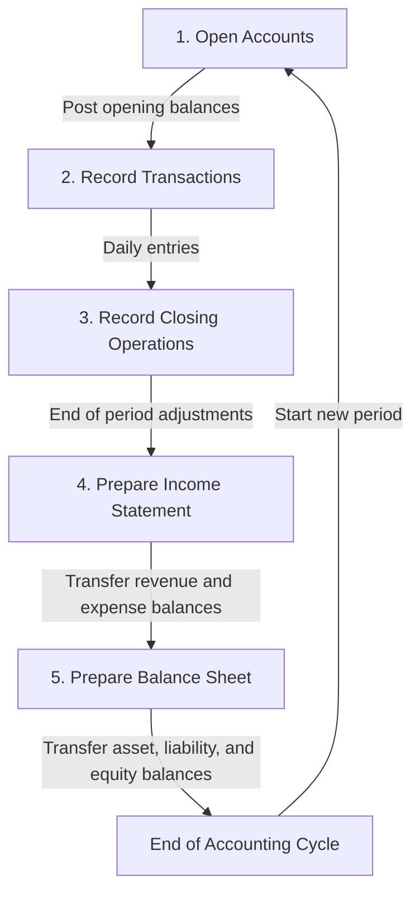

### Tags:[[Journal]], [[Ledger]], [[Debit]], [[Credit]], [[Assets]], [[Liabilities]], [[Costs]], [[Revenues]]
# Double-entry bookkeeping

## Summary

Double-entry bookkeeping is a fundamental accounting system that provides a comprehensive method for recording and organizing financial transactions. Key concepts and procedures include:

1. **Dual Aspect Concept**: Each transaction affects at least two accounts, maintaining the accounting equation (Assets = Liabilities + Equity).

2. **Account Types**: 
   - Balance sheet accounts (assets, liabilities, equity) - permanent
   - Income statement accounts (revenues, expenses) - temporary

3. **Debit and Credit**: Used to record increases and decreases in accounts, following specific rules for each account type.

4. **T-Accounts**: Visual representation of accounts, showing debits on the left and credits on the right.

5. **Accounting Cycle**: A systematic process including:
   - Opening accounts
   - Recording transactions
   - Closing entries
   - Preparing financial statements

6. **Financial Statements**: The end product of the accounting process, including the balance sheet, income statement, and cash flow statement.

This system ensures accuracy in financial reporting by requiring that the total debits always equal the total credits, providing a reliable method for tracking an organization's financial position and performance.

## Definitions and Important Concepts

Double-entry bookkeeping is a system developed in the 15th century to efficiently record business transactions and create financial statements. It's still used today and works as follows:
1. **Account Setup**: At the start of the year, create separate accounts for each item in the balance sheet and income statement.
2. **Transaction Recording**: Throughout the year, record increases and decreases in each account using debits and credits.
3. **Year-End Processing**: At year's end, calculate the final balance for each account and transfer these values to the income statement and balance sheet.

Key elements:
- **Account**: A record of all changes to a specific financial item (asset, liability, equity, revenue, or expense).
- **T-Account**: A visual representation of an account, shaped like a 'T':
	- Top: Account name
	- Left side: Debit
	- Right side: Credit
- **Debit**: Recording an amount on the left side of an account.
- **Credit**: Recording an amount on the right side of an account.
- **Balance**: The difference between total debits and credits in an account.
	- Debit balance: When debits > credits (common for assets)
	- Credit balance: When credits > debits (common for liabilities)

This system allows for efficient daily recording of transactions and quick preparation of financial statements at year-end.
## Revised Definitions and Concepts
- **Account**: A detailed record of changes in a particular asset, liability, equity, cost, or revenue. 
- **Debit**: The left side of an account, used for increases in assets and expenses, and decreases in liabilities and equity. 
- **Credit**: The right side of an account, used for increases in liabilities and equity, and decreases in assets. 
- **Balance**: The difference between the total debits and credits in an account.
## Key Accounting Principles
The class of an account regulates how increases and decreases are recorded as debit or credit. For any account, increases are recorded on one side and decreases on the other. The rules of recording debits and credits is based on the accounting equation 
$$\text{assets} = \text{liabilities} + \text{equity including result so} + \text{revenues} - \text{costs} $$
and considering that assets increase on credit and decrease on debit. As a summary:
![[Double-entry bookkeeping.png]]
Balance sheet accounts are “permanent” as they show the value at at a given date and start with an opening balance which is equal to the ending balance of the previous period (assets in debit, liabilities & equity in credit).
![[Balance-sheets accounts.png]]
Income statement accounts are “temporary” as they relate to a given period and are thus reset to zero at the beginning of each period to calculate the result generated in the period and therefore have no opening balance.
![[Income-statement accounts.png]]
At the end of the year, the balance of all accounts are transferred into the ending balance sheet (assets, liabilities & equity) and income statement (costs and revenues). 
Net income (the balance of income statement) is transferred to the balance sheet in a annual income or loss account in equity.

#### Phases of bookkeeping – The accounting cycle

1. Open the accounts at beginning of period, posting the opening balance of the balance sheet accounts
	→ assets ¦ balance sheet, balance sheet ¦ liabilities & equity
2. Record the business transactions during the period
	→ What accounts? How much Increase/decrease? In debit/credit?
3. Record the closing operations to comply with acc. norms
	→ What accounts? How much Increase/decrease? In debit/credit?
4. Prepare the income statement by transferring the balances of costs and revenues accounts to the income statement
	→ income statement ¦ costs, revenues ¦ income statement
5. Prepare of the [[Balance Sheet and Income Statements]] by transferring the balances of assets, liabilities, equity and net income to balance sheet
	→ balance sheet ¦ assets, liabilities & equity ¦ balance sheet
	→ income statement ¦ balance sheet (if income, viceversa if loss)
## Formulas and Calculations
- Asset accounts: Debit to increase, Credit to decrease
- Liability and Equity accounts: Credit to increase, Debit to decrease
- Revenue accounts: Credit to increase, Debit to decrease
- Expense accounts: Debit to increase, Credit to decrease

## Example Problems
*Step-by-step solutions to relevant accounting problems*

## Financial Statements Impact
- Balance Sheet: Reflects the cumulative effect of all transactions on assets, liabilities, and equity. 
- Income Statement: Shows the revenues earned and expenses incurred during a specific period. 
- Cash Flow Statement: Illustrates how transactions affect cash inflows and outflows.

## Questions for Review
1. Question 1?
2. Question 2?
...

## References
- [Textbook Title](Citation.md)
- Lecture notes, Date: [Topic]
- Course material: [[PrinciplesOfAccounting_03_Theory.pdf]]
