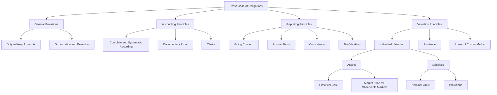

### Tags: [[Double-Entry Method]],[[General Provisions]], [[Accounting Principles]], [[Reporting Principles]], [[Valuation Principles]]
# Regulatory framework of accounting

## Summary

This document covers the main accounting concepts and procedures outlined in the [[Swiss Code of Obligations.pdf]] (CO). It includes general provisions, accounting principles, reporting principles, and valuation principles that form the regulatory framework for accounting in Switzerland.

## Definitions and Important Concepts

- Accounting: The process of recording, classifying, and summarizing financial transactions to provide information that is useful in making business decisions.
- Financial Reporting: The process of producing statements that disclose an organization's financial status to management, investors, and the government.
- Swiss Code of Obligations (CO): The primary source of Swiss private law and the part of it that regulates accounting and financial reporting.

## Key Accounting Principles

1. Going Concern Principle (CO 958a): Assumes that the business will continue to operate for the foreseeable future.
2. Accrual Basis (CO 958b): Transactions are recorded when they occur, not when cash is exchanged.
3. Consistency (CO 958c): The same accounting methods should be used from one period to the next.
4. Prudence (CO 960): Assets should not be overvalued, and liabilities should not be undervalued.
5. Individual Valuation (CO 960): Assets and liabilities should be valued individually if significant.
6. Reliability (CO 958c): Financial information should be free from material error and bias.
7. Completeness (CO 958c): All transactions and events should be recorded.
8. Materiality (CO 958c): Information is material if its omission or misstatement could influence the economic decisions of users.
9. No Offsetting (CO 958c): Assets and liabilities, and income and expenses, should not be offset unless required or permitted by an accounting standard.

## Formulas and Calculations

While the document doesn't provide specific formulas, it mentions several important calculations:

1. Depreciation: Systematic allocation of the cost of an asset over its useful life.
2. Valuation Adjustments: Reductions in the carrying amount of an asset to reflect a decrease in its value.
3. Inventory Valuation: Lower of cost or market value.
4. Provisions: Estimated future obligations recorded as liabilities.

## Example Problems

The document doesn't provide specific example problems, but here's a conceptual example based on the principles discussed:

Problem: A company purchases inventory for 100,000 CHF. At the end of the year, the market value of this inventory has dropped to 80,000 CHF. How should this be reflected in the financial statements according to the Swiss Code of Obligations?

Solution: According to CO 960c, inventories should be valued at the lower of cost or market value. In this case:

- Original cost: 100,000 CHF
- Market value: 80,000 CHF
- Valuation in financial statements: 80,000 CHF
- Valuation adjustment to be recorded: 20,000 CHF (as an expense in the profit and loss account)

## Financial Statements Impact

The regulatory framework impacts financial statements in several ways:

1. [[Balance Sheet]]: Assets are generally valued at no more than their acquisition or manufacturing costs (CO 960a). Liabilities are entered at their nominal value (CO 960e).
2. [[Income Statement]]: Depreciation and valuation adjustments must be charged to the profit and loss account (CO 960a).
3. Notes to the Accounts: Additional information must be provided to supplement and explain other parts of the annual accounts (CO 959c).
4. Cash Flow Statement: Required for larger undertakings (not covered in detail in the provided slides).

## Questions for Review

1. What are the main sections of the Swiss Code of Obligations related to accounting?
2. Explain the going concern principle and its implications for financial reporting.
3. What is the difference between depreciation and valuation adjustments?
4. How should assets with observable market prices be valued according to CO 960b?
5. What information must be included in the notes to the accounts according to CO 959c?
6. How does the principle of prudence apply to the valuation of assets and liabilities?
7. What are the valuation rules for inventories and non-invoiced services?
8. How does the Swiss Code of Obligations define capital assets?
9. What are the rules for creating and maintaining provisions?
10. How does the regulatory framework ensure the reliability and comparability of financial statements?

## References

- [[Swiss Code of Obligations]] (CO), Articles 957-963
- Lecture notes: [[Swiss Financial Statement Assessment Process]]
- Course material: [[PrinciplesOfAccounting_04_Theory.pdf]]
