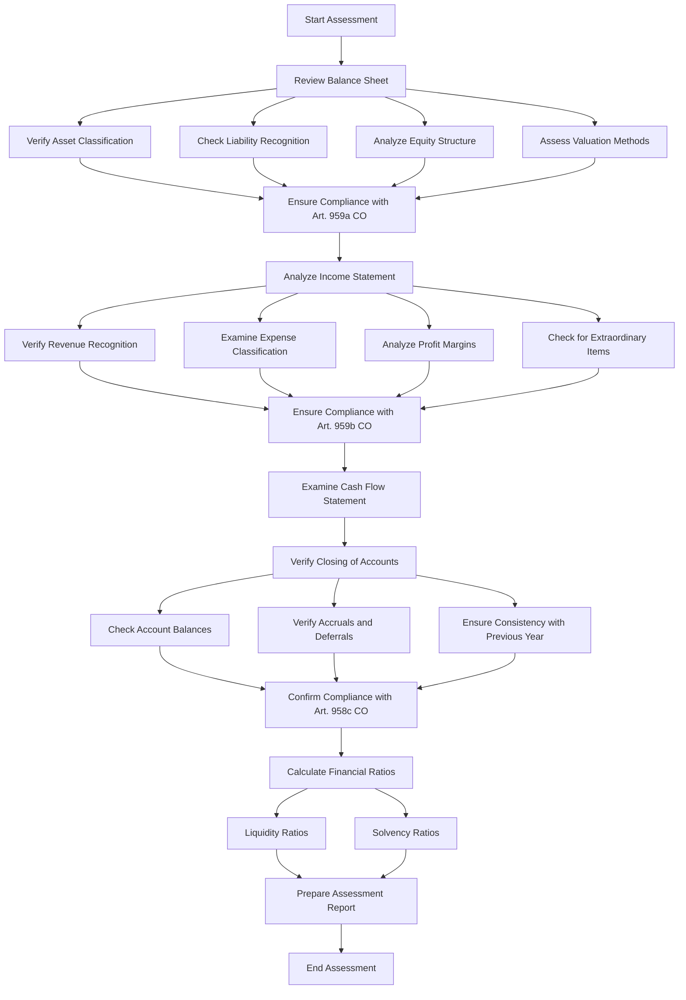

### Tags: [[Swiss Accounting]], [[Financial Statements]],[[ Balance Sheet]], [[Income Statement]], [[Cash Flow Statement]]

### Swiss Financial Statement Assessment Process

## Summary
This document outlines the process for assessing financial statements in accordance with Swiss regulations and the Swiss Code of Obligations (CO). It covers the review of the balance sheet, income statement, cash flow statement, and the closing of accounts, as well as the calculation of key financial ratios.

## Definitions and Important Concepts

- Balance Sheet: A financial statement that provides a snapshot of a company's financial position at a specific point in time, showing assets, liabilities, and equity (Art. 959a CO).
- Income Statement: A financial statement that shows a company's financial performance over a specific period, detailing revenues, expenses, and profit or loss (Art. 959b CO).
- Cash Flow Statement: A financial statement that shows how changes in balance sheet accounts and income affect cash and cash equivalents.
- Closing of Accounts: The process of finalizing financial records at the end of an accounting period (Art. 958c CO).
- Liquidity Ratios: Financial metrics that measure a company's ability to meet short-term obligations.
- Solvency Ratios: Financial metrics that assess a company's ability to meet long-term debts and obligations.

## Key Accounting Principles

- Principle of Prudence (Art. 958c para. 1 no. 5 CO): Requires conservative valuations and estimates to avoid overstatement of assets and understatement of liabilities.
- Going Concern Principle (Art. 958a CO): Assumes that the company will continue its operations for the foreseeable future.
- Materiality Principle (Art. 958c para. 1 no. 4 CO): Focuses on items that could influence the decisions of financial statement users.
- Consistency Principle (Art. 958c para. 3 CO): Requires consistent application of valuation principles and presentation methods.
- Accrual Principle (Art. 958b CO): Requires recording of transactions when they occur, not when cash is exchanged.

## Financial Statements Impact

### Balance Sheet Assessment:
1. Verify Asset Classification:
   - Impacts: Current vs. non-current asset ratios, liquidity ratios
2. Check Liability Recognition:
   - Impacts: Debt ratios, solvency ratios
3. Analyze Equity Structure:
   - Impacts: Owner's equity, retained earnings
4. Assess Valuation Methods:
   - Impacts: Asset values, depreciation/amortization expenses

### Income Statement Assessment:
1. Verify Revenue Recognition:
   - Impacts: Total revenue, profit margins
2. Examine Expense Classification:
   - Impacts: Gross profit, operating profit
3. Analyze Profit Margins:
   - Impacts: Profitability ratios
4. Check for Extraordinary Items:
   - Impacts: Net income, comparability between periods

### Cash Flow Statement Examination:
- Impacts: Cash position, liquidity, and ability to generate cash

### Closing of Accounts Verification:
1. Check Account Balances:
   - Impacts: Accuracy of all financial statements
2. Verify Accruals and Deferrals:
   - Impacts: Timing of revenue and expense recognition
3. Ensure Consistency with Previous Year:
   - Impacts: Comparability of financial statements over time

### Financial Ratios Calculation:
- Liquidity Ratios (e.g., Current Ratio, Quick Ratio):
  - Impact: Assessment of short-term financial health
- Solvency Ratios (e.g., Debt-to-Equity Ratio, Interest Coverage Ratio):
  - Impact: Evaluation of long-term financial stability

The assessment process ensures compliance with Swiss regulations while providing a comprehensive view of a company's financial position, performance, and cash flows. It helps identify potential issues, ensures accurate reporting, and provides insights for decision-making by stakeholders.

## References

- [[Swiss Code of Obligations]] (CO), Articles 957-963
- Course material: [[PrinciplesOfAccounting_03_Theory.pdf]], [[PrinciplesOfAccounting_04_Theory.pdf]]