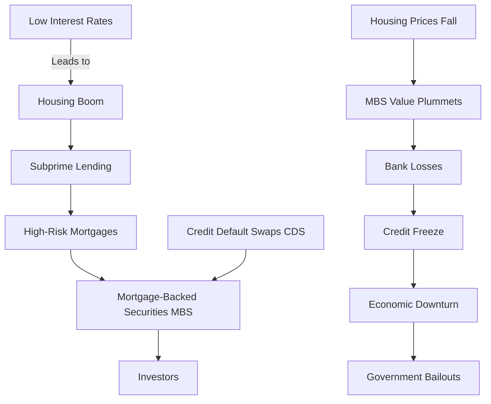

### Tags: [[MBS]], [[Credit Default Swaps]], [[Housing Market]], [[Interest Rates]], [[Subprime Loans]], [[LTV]], [[Tranches]], [[Credit Risk]]
# Financial Crysis of 2007-2009

## Summary

The Financial Crisis of 2007-2009 was primarily triggered by the collapse of the U.S. housing market, exacerbated by complex financial instruments such as Mortgage-Backed Securities (MBS) and Credit Default Swaps (CDS). The crisis began in the housing sector but quickly spread to the broader financial system, ultimately requiring government intervention to prevent a complete economic meltdown.

## Definitions and Important Concepts

- MBS (Mortgage-Backed Securities): Investments consisting of a bundle of home loans and other real estate debt bought from the banks that issued them.
- CDS (Credit Default Swaps): Financial derivatives that allow investors to swap or offset their credit risk with that of another investor.
- LTV (Loan-to-Value) ratio: An assessment of lending risk that financial institutions examine before approving a mortgage.
- Subprime Loans: Loans made to borrowers with poor credit histories, often with higher interest rates.
- Tranches: Portions of a pooled collection of securities, usually debt instruments, that are split up by risk or other characteristics.
- Credit Risk: The risk of loss resulting from a borrower's failure to repay a loan or meet contractual obligations.

## Financial Theories/Models

- Securitization: The process of pooling various types of debt instruments and selling them as securities to investors.
- Risk Assessment Models: Tools used by financial institutions to evaluate the creditworthiness of borrowers and the risk of default.

## Market Applications

1. Housing Market:
    - Low interest rates and relaxed lending standards led to a housing boom.
    - Increased use of subprime mortgages with high LTV ratios.
    - Rising home prices created a speculative bubble.
2. Financial Market:
    - Banks created and sold MBS, transferring the risk of subprime mortgages to investors.
    - CDS were used to insure against potential defaults, creating a false sense of security.
    - When housing prices began to fall, the value of MBS plummeted, causing significant losses for investors and financial institutions.

## Case Studies or Examples

1. Lehman Brothers Collapse: The failure of this major investment bank due to its exposure to subprime mortgages and MBS.
2. AIG Bailout: The government rescue of AIG, which had sold massive amounts of CDS and faced bankruptcy when required to pay out.

## Risk Considerations

- Underestimation of systemic risk in the housing market.
- Over-reliance on complex financial instruments without fully understanding their risks.
- Inadequate regulation of the shadow banking system.
- Misalignment of incentives in the mortgage origination and securitization process.

## Key Takeaways

1. The interconnectedness of the housing market and the financial sector through MBS and CDS amplified the crisis.
2. High LTV ratios and subprime lending practices increased overall credit risk in the system.
3. The crisis spread from the housing market to the broader financial sector, necessitating government intervention.
4. The event highlighted the need for better risk management and financial regulation.

## Questions for Analysis

1. How did the misuse of financial instruments like MBS and CDS contribute to the severity of the crisis?
2. What role did credit rating agencies play in the lead-up to the financial crisis?
3. How have regulatory frameworks changed since the crisis to prevent similar events in the future?

## References

- Financial Crisis Inquiry Commission. (2011). The Financial Crisis Inquiry Report. U.S. Government Printing Office.
- Tooze, A. (2018). Crashed: How a Decade of Financial Crises Changed the World. Viking.
- Lecture notes, Date: [Financial Crisis of 2007-2009]
- Course material: [Chapter on Modern Financial Crises]