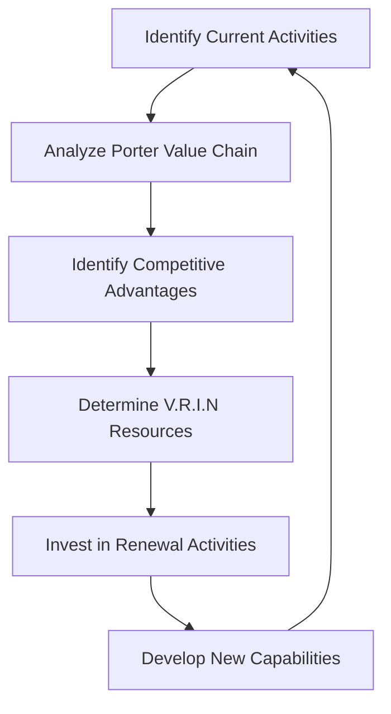

### Tags: [[Function]], [[Processes]], [[Internal Management]], [[Current Activities]], [[Renewal Activities]], [[Porter Value Chain]], [[V.R.I.N]], [[Strategic Management]], [[Competitive Advantage]], [[Resource-Based View]], [[Dynamic Capabilities]], [[Innovation Management]], [[Organizational Design]]
# Current and Renewal Economic Activities

## Summary
This document explores the concepts of current and renewal economic activities, their differences, and their importance in maintaining a company's competitive advantage. We'll examine these concepts through the lens of the Porter Value Chain and the V.R.I.N framework, with practical examples from major tech companies.

## Definitions and Important Concepts
- All activities generate  cost or a profit 
### Current Activities

Current activities are those that generate revenue for a company in the present or near future. These activities are typically focused on maintaining and growing existing customer relationships, managing day-to-day operations, and generating cash flow. Examples of current activities include:

* Sales and marketing
* Customer service and support
* Production and manufacturing
* Distribution and logistics
* Financial management and accounting

### Renewal Activities

Renewal activities, on the other hand, are those that help a company sustain its competitive position over time by investing in new technologies, processes, and relationships. These activities focus on maintaining or improving existing capabilities to stay ahead of competitors and adapt to changing market conditions. Examples of renewal activities include:

* Research and development (R&D)
* Process innovation
* Talent acquisition and development
* Strategic partnerships and collaborations
* Brand management and reputation building

**Key differences:**

1. **Focus**: Current activities focus on generating revenue, while renewal activities focus on sustaining a company's competitive position.
2. **Time horizon**: Current activities are typically short-term focused, while renewal activities have a longer time horizon (e.g., 3-5 years).
3. **Investment**: Renewal activities often require significant investments in new technologies, processes, and relationships.

By understanding the differences between current and renewal activities, organizations can allocate resources effectively to drive growth, improve competitiveness, and create long-term value for their stakeholders.

#### Porter Value Chain
![[Value chain theory.png]]

The Porter Value Chain is a framework for analyzing a company's competitive position by identifying its core processes and activities.
* **Definition**: The Porter Value Chain is a framework for analyzing a company's competitive position by identifying its core processes and activities.
* **Five Primary Stages**:
	1. Inbound Logistics
	2. Operations
	3. Outbound Logistics
	4. Marketing and Sales
	5. Service
* **Value Chain Process**: The Porter Value Chain involves transforming an input into a product or service through various stages.

#### 3 Companies at a glance: Applying activities and the Porter Value Chain

| Company   | Image                                            |
| --------- | ------------------------------------------------ |
| Amazon    | ![[amazon_income_statement_sankey_chart.png]]    |
| Facebook  | ![[facebook_income_statement_sankey_chart.png]]  |
| Microsoft | ![[microsoft_income_statement_sankey_chart.png]] |
##### Amazon

1. Current Activities:
    - E-commerce platform (core business)
    - Amazon Prime subscription service
    - Fulfillment and logistics
    - Amazon Web Services (AWS) cloud computing
2. Renewal Activities:
    - Artificial Intelligence and Machine Learning research
    - Drone delivery technology (Amazon Prime Air)
    - Expansion into new markets (e.g., healthcare with Amazon Care)
    - Sustainable energy initiatives

Porter Value Chain Analysis:

- Inbound Logistics: Advanced warehouse management systems, robotics
- Operations: Highly efficient fulfillment centers, AI-driven inventory management
- Outbound Logistics: Last-mile delivery optimization, Amazon Logistics
- Marketing and Sales: Personalized recommendations, Amazon Prime Day
- Service: 24/7 customer support, easy returns policy

Amazon excels in both current and renewal activities. Its e-commerce platform and AWS represent strong current activities, while investments in AI, drone technology, and new market expansions show a commitment to renewal. Amazon's value chain is highly optimized, with a particular focus on logistics and operations.

##### Facebook (Meta)

1. Current Activities:
    - Social media platforms (Facebook, Instagram, WhatsApp)
    - Digital advertising
    - Facebook Marketplace
2. Renewal Activities:
    - Virtual and Augmented Reality (Metaverse)
    - AI and Machine Learning for content moderation and personalization
    - Cryptocurrency initiatives (Diem, formerly Libra)
    - Internet connectivity projects (e.g., Facebook Connectivity)

Porter Value Chain Analysis:

- Inbound Logistics: Data centers, content delivery networks
- Operations: AI-driven content curation and moderation
- Outbound Logistics: User interface and experience design
- Marketing and Sales: Targeted advertising platform
- Service: Community standards enforcement, user support

Facebook (Meta) has a strong focus on current activities through its social media platforms and advertising business. Its renewal activities, particularly the heavy investment in the Metaverse, show a long-term vision for future growth. The company's value chain is centered around data management and user engagement.

##### Microsoft

1. Current Activities:
    - Microsoft 365 suite of productivity tools
    - Windows operating system
    - Xbox gaming division
    - Azure cloud computing platform
2. Renewal Activities:
    - Artificial Intelligence and Machine Learning research
    - Quantum computing
    - Mixed reality (HoloLens)
    - Sustainable technology initiatives

Porter Value Chain Analysis:

- Inbound Logistics: Software development tools, cloud infrastructure
- Operations: Agile development processes, DevOps practices
- Outbound Logistics: Digital distribution platforms (Microsoft Store, Azure Marketplace)
- Marketing and Sales: Enterprise sales teams, partner network
- Service: Microsoft Support, regular software updates

Microsoft demonstrates a balance between current and renewal activities. Its suite of productivity tools and Azure platform represent strong current activities, while investments in AI, quantum computing, and mixed reality show a commitment to future technologies. Microsoft's value chain emphasizes software development and enterprise solutions.

Analysis:

1. Current vs. Renewal Activities:
    - Amazon: Strong balance, with a slight edge in current activities
    - Facebook (Meta): Heavy investment in renewal activities (Metaverse), but still reliant on current social media platforms
    - Microsoft: Well-balanced approach with strong current revenue streams and significant investment in future technologies
2. Porter Value Chain:
    - Amazon: Excels in logistics and operations
    - Facebook (Meta): Focuses on data management and user engagement
    - Microsoft: Emphasizes software development and enterprise solutions
3. Innovation and Adaptability:
    - All three companies show a strong commitment to innovation through their renewal activities
    - Amazon and Microsoft appear to have more diversified portfolios, potentially providing more stability
    - Facebook's heavy investment in the Metaverse represents a bold but risky renewal strategy
4. Competitive Advantage:
    - Amazon: Logistics network and diverse revenue streams
    - Facebook (Meta): Massive user base and data-driven advertising
    - Microsoft: Strong enterprise presence and cloud computing capabilities

##### In short

| Company   | Current Activities                                                                                                        | Renewal Activities                                                                                                                                               | Porter Value Chain Analysis                                                                                                                                              | Competitive Advantage                                       |
| --------- | ------------------------------------------------------------------------------------------------------------------------- | ---------------------------------------------------------------------------------------------------------------------------------------------------------------- | ------------------------------------------------------------------------------------------------------------------------------------------------------------------------ | ----------------------------------------------------------- |
| Amazon    | E-commerce platform, AWS, Fulfillment, Prime subscription service                                                         | AI research, Drone delivery technology, Expansion into new markets (e.g., healthcare with Amazon Care), Sustainable energy initiatives                           | Advanced warehouse management systems, robotics; Highly efficient fulfillment centers, AI-driven inventory management; Last-mile delivery optimization, Amazon Logistics | Logistics network and diverse revenue streams               |
| Facebook  | Social media platforms, Digital advertising, Facebook Marketplace                                                         | Virtual and Augmented Reality (Metaverse), AI and Machine Learning for content moderation and personalization, Cryptocurrency initiatives (Diem, formerly Libra) | Data centers, content delivery networks; AI-driven content curation and moderation; User interface and experience design                                                 | Massive user base and data-driven advertising               |
| Microsoft | Microsoft 365 suite of productivity tools, Windows operating system, Xbox gaming division, Azure cloud computing platform | Artificial Intelligence and Machine Learning research, Quantum computing, Mixed reality (HoloLens), Sustainable technology initiatives                           | Software development tools, cloud infrastructure; Agile development processes, DevOps practices; Digital distribution platforms (Microsoft Store, Azure Marketplace)     | Strong enterprise presence and cloud computing capabilities |

#### Resources and Activities cycle 

#### V.R.I.N  
The V.R.I.N model is a framework used to analyze the value of resources in an organization. It was first introduced by Michael Porter and his colleagues.

V.R.I.N stands for:

* **V**: Value - The resource must have value to the organization.
* **R**: Rarity - The resource must be rare or scarce, meaning it cannot be easily replicated or substituted.
* **I**: Inimitability - The resource must be difficult to imitate or replicate, making it unique and valuable.
* **N**: Non-substitutability - The resource must be non-substitutable, meaning that there is no suitable substitute available.

In other words, a resource has V.R.I.N if it meets all four criteria:

1. It has value to the organization.
2. It is rare or scarce.
3. It is difficult to imitate or replicate.
4. There is no suitable substitute available.

By analyzing the V.R.I.N of resources, organizations can identify areas where they have a competitive advantage and focus their efforts on developing and maintaining those resources.

### Applying V.R.I.N to Tech Giants

| Company   | V.R.I.N Resource              | V                                | R                                | I                                | N                                |     |
| --------- | ----------------------------- | -------------------------------- | -------------------------------- | -------------------------------- | -------------------------------- | --- |
| Amazon    | Logistic Network              | <input type="checkbox" checked > | <input type="checkbox" checked > | <input type="checkbox" checked > | <input type="checkbox" checked > |     |
| Facebook  | User data and engagement      | <input type="checkbox" checked > | <input type="checkbox" checked > | <input type="checkbox" checked > |                                  |     |
| Microsoft | Enterprise software ecosystem | <input type="checkbox" checked > | <input type="checkbox" checked > | <input type="checkbox" checked > | <input type="checkbox" checked > |     |
## Revised Definitions and Concepts

## Management Theories

1. **Resource-Based View (RBV)**: Emphasizes the importance of internal resources and capabilities in achieving competitive advantage.
2. **Dynamic Capabilities**: Focuses on a firm's ability to integrate, build, and reconfigure internal and external competences to address rapidly changing environments.
3. **Disruptive Innovation**: Describes how small companies with fewer resources can challenge established businesses by addressing overlooked segments of the market.
4. **Blue Ocean Strategy**: Advocates creating uncontested market space (blue oceans) rather than competing in existing markets (red oceans).
5. **Ambidextrous Organization**: Suggests that successful companies can both exploit existing capabilities and explore new opportunities simultaneously.

## Practical Applications

1. **Strategic Planning**: Use the Porter Value Chain and V.R.I.N analysis to identify areas for improvement and investment.
2. **Resource Allocation**: Balance investments between current and renewal activities to ensure short-term profitability and long-term sustainability.
3. **Innovation Management**: Develop processes to foster both incremental improvements (current activities) and radical innovations (renewal activities).
4. **Competitive Analysis**: Use these frameworks to assess competitors and identify potential threats or opportunities in the market.
5. **Organizational Design**: Structure the company to support both current and renewal activities, possibly using an ambidextrous approach.

## Case Studies

1. **Apple's iPod and iPhone**: Illustrates how a company can use renewal activities (developing new product categories) to create new markets and revenue streams.
2. **Netflix's Transition to Streaming**: Demonstrates the importance of investing in renewal activities even when current activities are successful.
3. **Kodak's Failure to Adapt**: Shows the risks of focusing too heavily on current activities at the expense of renewal activities.

## Key Takeaways

- Understanding the Porter Value Chain is crucial for identifying areas where a company can optimize its current activities and invest in renewal activities.
- By analyzing the value chain, organizations can identify opportunities to improve efficiency, reduce costs, and create long-term value for their stakeholders.
- Balancing current and renewal activities is crucial for long-term success.
- V.R.I.N resources are key to sustaining competitive advantage.
- Successful companies continuously invest in both exploiting existing capabilities and exploring new opportunities.
- Adapting to changing market conditions often requires significant investment in renewal activities.

## References
- [Book/Article Title](URL or citation)
- Lecture notes, Date: [Topic]
- Course material: [Specific reference]
